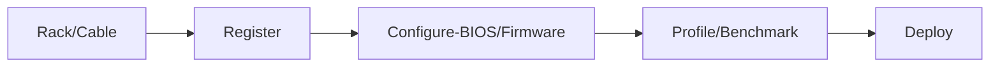
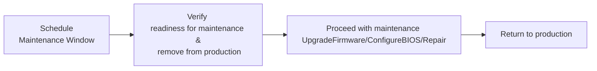

## About

The Metal Automata project aims to enable server operators and admistrators by providing  
opensource automation and workflows to manage the hardware lifecycle of a fleet of servers.  

While this project is focussed on large scale server deployments, it hopes to serve smaller deployments or hobbyists running a [homelab](https://www.reddit.com/r/homelab/). 

## Why

The Metal Automata project includes libraries, automation and workflows that can be leveraged to enforce these properties in a server fleet.

The author(s) has identified a lack of automation and processes when managing a fleet of servers,  
The situation is even more pronounced when,  

 - The server fleet is heterogeneous (hardware from multiple vendors and generations)
 - Hardware vendors do not follow a common set of standards
 - Hardware vendors interpret standards differently
 - Operational processes to manage servers span multiple teams

Once a server has booted into an Operating system, there's a plethora of tooling and automation  
to ensure configuration, performance, availability and security of the system.

Although deploying servers and managing the hardware, firmware and ensuring its conformance involves significant operational overhead.  

Multiple days and hours are spent spinning up a new datacenter or installing new racks with hardware,  
the challenge lies in managing the fleet in a scalable and repeatable manner along with observability  
into the conformance, resource consumption and overall health of the fleet.  

Server hardware has a limited lifespan, during which various operational actions have to be carried out  
to ensure the fleet is continuously,

 - **Consistent** in its hardware configuration and firmware
 - **Performant** in delivering the compute/storage functions
 - **Secure** by staying up-to-date with vendor firmware
 - **Available** by enabling lesser Mean Time To Detecting problems and reducing Mean Time To Resolve them.

Engineers automating large scale server deployments eventually converge to similar patterns of automation and processes  
to ensure the above mentioned mentioned properties.

In most cases the automation and workflows are built internally and are customized to the environment,  
the automation and workflows and in these environments are tightly coupled into internal processes and systems.

And when the work involved to deploy/manage/maintain servers for production use is not automated  
the details tend to be held in tribal knowledge that lives across multiple teams or siloed codebases, runbooks.

## How

The Metal Automata project draws from [published documents](#references) on the subject
and from the author's experiences eworking on large server deployments.

This project intends to provide open-source automation and repeatable, clear processes (workflows)  
that could be used out of the box or extended and maintained independently by its enthusiasts.

The project strives to be vendor neutral and focuses on providing operators a cohiesive suite of  
interfaces and tools to take servers from being racked to having them ready for running an Operating system. 

The process of racking, cabling servers until they are ready for production workloads can be visualized as
servers traversing on a conveyor belt, while its time on the conveyor belt, the servers may be dealt by one or more teams,  
along with automation to vet, prepare the server for for production use.  

In most cases, this conveyor belt and processes acting on it could be expressed as a workflow,   
each step in the workflow is handled by an operator manually or through automation  
the actions handled by the operator manually would be through a ticketing system.

The goal here is to have each action encoded in workflows, the steps of which block on an API,
the API owners could be multiple teams or it could be a ticketing system. 

As of this writing, the focus is on bare metal Servers, ultimately the project intends support PDUs and Switches.

Below are some example server management workflows that could be supported by this project,

### New server deployments

Each server or groups of them can then be put through those repeatable workflows,

### Server maintenance/repair workflow

A maintenance or repair flow would enable

The Metal Automata system enables server administrators to execute workflows on server hardware,
these workflows are initiated and executed with the help of various automata software components,

- API
- Queue
- Orchestrator
- Controllers
- Reconciler

These software components involved are described in the automation docs  
and are the core component ensuring the properties of the system as defined in the workflow or reconcile loops.

### References

 - [The Datacenter as a Computer: An Introduction to the Design of Warehouse-Scale Machines](https://research.google/pubs/the-datacenter-as-a-computer-an-introduction-to-the-design-of-warehouse-scale-machines-second-edition/)
- [The AI Battlefield Engineering](https://github.com/stas00/ml-engineering/blob/master/insights/ai-battlefield.md)
- [How Facebook deals with PCIe faults to keep our data centers running reliably](https://engineering.fb.com/2021/06/02/data-center-engineering/how-facebook-deals-with-pcie-faults-to-keep-our-data-centers-running-reliably/)
- [Making Facebook self-healing: Automating proactive rack maintenance](https://engineering.fb.com/2016/07/11/production-engineering/making-facebook-self-healing-automating-proactive-rack-maintenance/)
- [Fast Dimensional Analysis for Root Cause Investigation in a Large-Scale Service Environment](https://research.facebook.com/publications/fast-dimensional-analysis-for-root-cause-investigation-in-a-large-scale-service-environment/)
- [Dynamo: Facebook’s Data Center-Wide Power Management System](https://research.facebook.com/publications/dynamo-facebooks-data-center-wide-power-management-system/)
